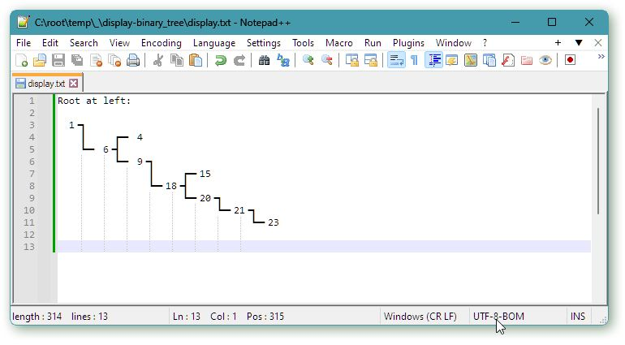

<!-- https://www.facebook.com/groups/cppEnthusiasts/posts/6005403052852298/ -->

A little **challenge** for the group members and readers:

*display a binary tree with Unicode box drawing characters, as shown in the screenshot (or similar, considering potential for improvement).*

The binary tree shown in the screenshot is very lopsided, and any solution should be able to handle that. Data: 1 6 9 4 18 15 20 21 23 Wikipedia has a table of the box drawing characters at <url: https://en.wikipedia.org/wiki/Box-drawing_character>.

---

There is an algorithmic problem here, and there is a C++ design problem due to the lack of UTF-8 support in the standard library.

---

I posted this challenge about a week ago in the sister group “C++ in-practice questions (most anything!)”, <url: https://www.facebook.com/.../cppI.../posts/6116362595051346/>, with so far two people posting their solutions.

One solution (by Замфир Йончев) treated variable length UTF-8 characters as strings, while the other (by Daniel Astbury) converted from UTF-16 wide characters to possibly variable length narrow encoding on output. Apparently, from shallow inspection, both built the output in a 2D array of characters.

An additional challenge is to instead generate the output line by line, i.e. using only O(n) storage where n is the depth of the tree.

